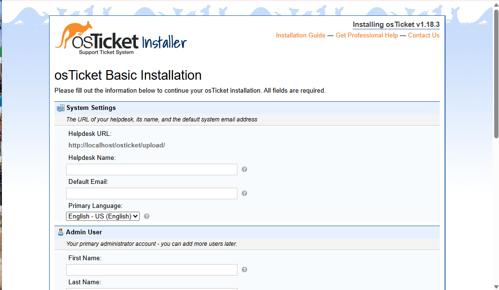
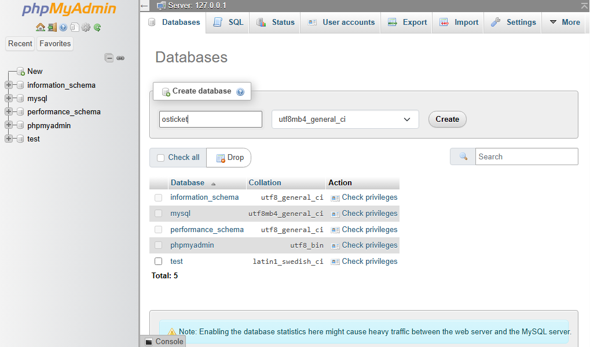
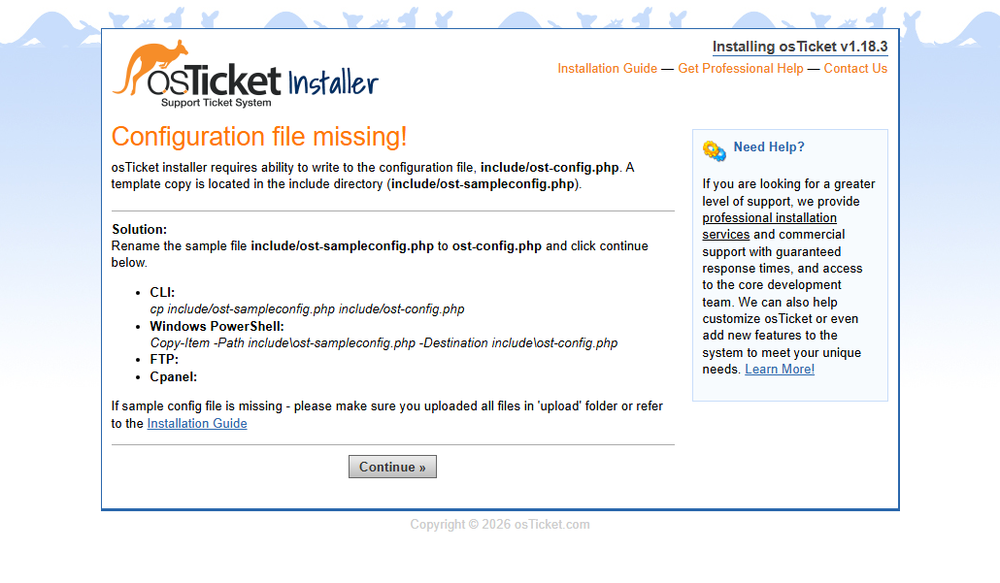
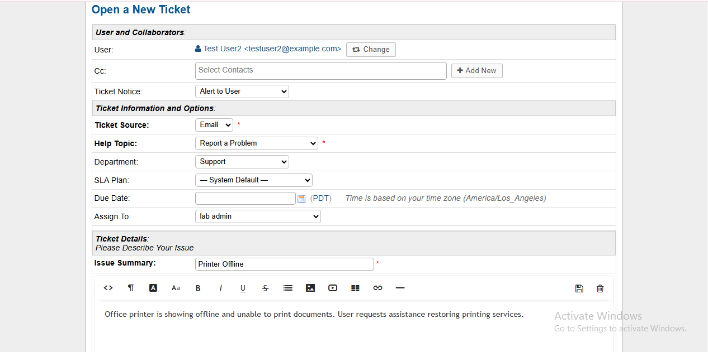
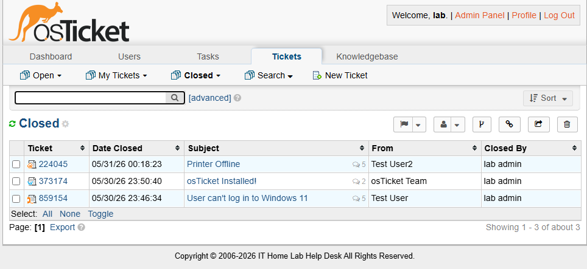

# 🎫 Help Desk Ticketing System Lab

---

## 🖥️ Project Overview

This project is part of my IT Home Lab where I practice real-world help desk and IT support skills using:

- Windows 11 VM
- osTicket
- Linux Host Machine
- GitHub Documentation

The goal of this lab is to simulate a real IT support environment by creating and resolving support tickets while documenting troubleshooting steps professionally.

---

## 🛠️ Technologies Used

| Technology | Purpose |
|---|---|
| Windows 11 VM | Help Desk Environment |
| osTicket | Ticketing System |
| GitHub | Documentation |
| Linux | Host Operating System |
| QEMU/KVM | Virtualization |

---

## 📋 Ticket Scenarios

- 🔑 Password Reset
- 🌐 Network Connectivity Issues
- 🖨️ Printer Troubleshooting
- 💾 Software Installation
- 📁 Shared Folder Access

---

## 🧠 Skills Practiced

- Help Desk Support
- Ticket Documentation
- Troubleshooting
- Windows Administration
- Networking Basics
- Customer Service Workflow

---

## Lab Walkthrough 📸

### Step 1: Install osTicket

*Started the osTicket installation process.*

### Step 2: Create Database

*Created the MySQL database required by osTicket.*

### Step 3: Configure osTicket

*Configured the application settings and database connection.*

### Step 4: Access Admin Portal

*Logged into the administrative dashboard.*

### Step 5: Create a Ticket

*Created a test support ticket.*

### Step 6: Resolve Ticket

*Resolved the ticket and documented the resolution.*

---

## 🚀 Future Improvements

- Add Active Directory integration
- Create SLA ticket priorities
- Simulate phishing/security tickets
- Add remote support scenarios

