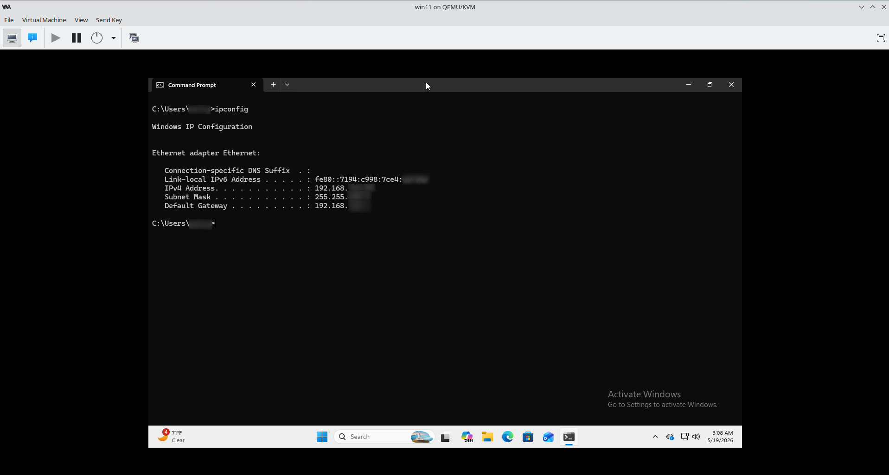
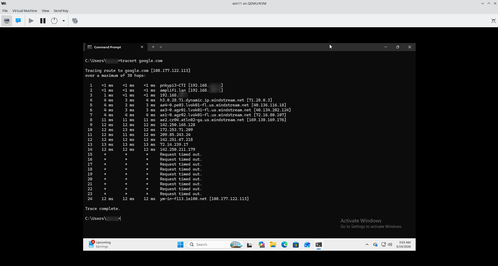

# 🌐 Network Troubleshooting Lab

## 📋 Overview

This lab focuses on basic network troubleshooting techniques using Windows command-line tools. The goal is to identify connectivity issues, verify network configurations, troubleshoot DNS resolution, and analyze packet routes.

---

## 🎯 Objectives

- Verify IP configuration
- Test network connectivity
- Troubleshoot DNS resolution
- Analyze network paths
- Practice common IT support troubleshooting steps

---

## 🎥 Video Demonstration

📺 **Watch the complete lab walkthrough on YouTube:**

---

## 🛠️ Tools Used

| Tool | Purpose |
|---|---|
| Windows 11 VM | Lab environment |
| Command Prompt | Network diagnostics |
| Virtual Machine Manager | Virtualization platform |

---

## 🔧 Commands Practiced

### `ipconfig`

Displays network adapter configuration and IP addressing information.

### `ping`

Tests connectivity to local and remote hosts.

### `nslookup`

Verifies DNS name resolution.

### `tracert`

Displays the path packets take across a network.

---

## 📸 Screenshots

### IP Configuration

### Connectivity Testing

### DNS Resolution

### Route Tracing

