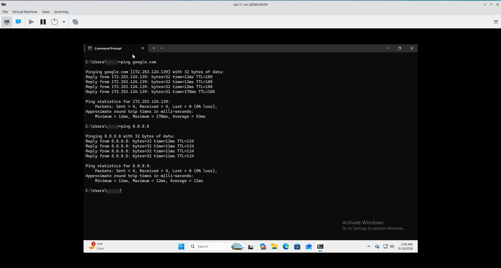
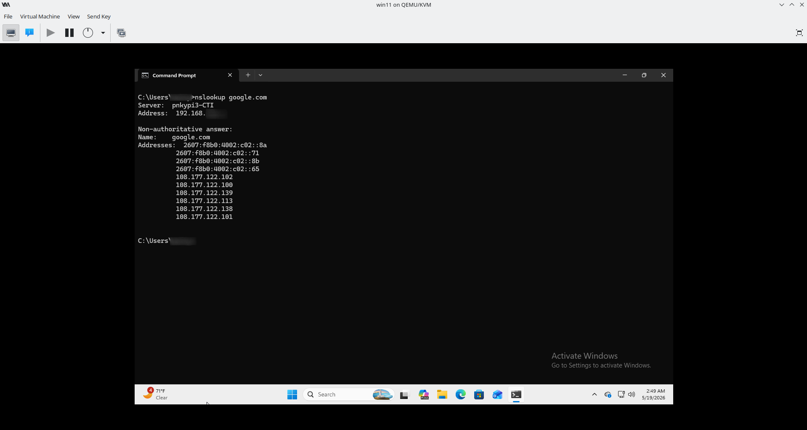
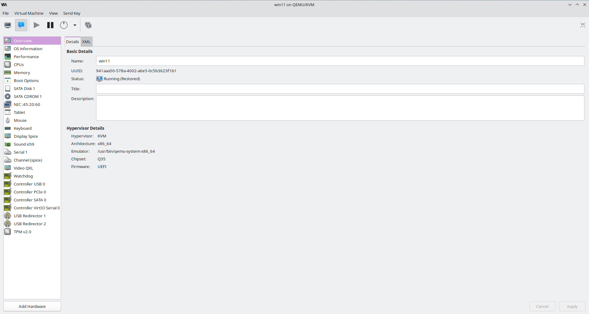

# IT Home Lab

Building hands-on IT and cybersecurity skills through virtual machines, troubleshooting labs, networking practice, and help desk simulations.

------------------------------------------------

## Lab Progress

| Project | Status |
|----------|----------|
| Windows 11 VM Setup | ✅ Complete |
| Network Troubleshooting | ✅ Complete |
| osTicket Help Desk Lab | ✅ Complete |
| Wireshark Packet Analysis | 🔄 In Progress |
| Cisco Packet Tracer Labs | 🔄 In Progress |
| Network+ Preparation | 📚 Ongoing |
------------------------------------------------

## Current Projects

### Windows 11 Virtual Machine Lab
Practicing Windows configuration, command-line tools, network troubleshooting, and system administration.

### osTicket Help Desk Lab
Simulating real help desk tickets, customer responses, troubleshooting steps, and ticket resolution.

### Network Troubleshooting Labs
Using tools like `ping`, `ipconfig`, `tracert`, and `nslookup` to diagnose common network issues.

### Wireshark Packet Analysis
Capturing and reviewing network traffic to better understand protocols and security monitoring.

### Cisco Packet Tracer Labs
Building basic networks and practicing routing, switching, and troubleshooting.

---

## Featured Lab Screenshots

### Network Connectivity Testing

Verified internet connectivity using ping.

### DNS Resolution

Used nslookup to verify DNS functionality.

### Virtual Machine Configuration

Configured a Windows 11 virtual machine using Virtual Machine Manager.

## Skills Practiced

- Windows 11 administration
- Virtual machine management
- Help desk ticketing
- Network troubleshooting
- Packet analysis
- Command-line tools
- Cybersecurity fundamentals
- Documentation

---

## Tools Used

- Windows 11 VM
- Linux Mint
- Virtual Machine Manager
- osTicket
- Wireshark
- Cisco Packet Tracer
- GitHub

---

## Goals

- Build a strong cybersecurity foundation
- Gain hands-on IT support experience
- Improve networking and troubleshooting skills
- Prepare for CompTIA Network+ and Security+
