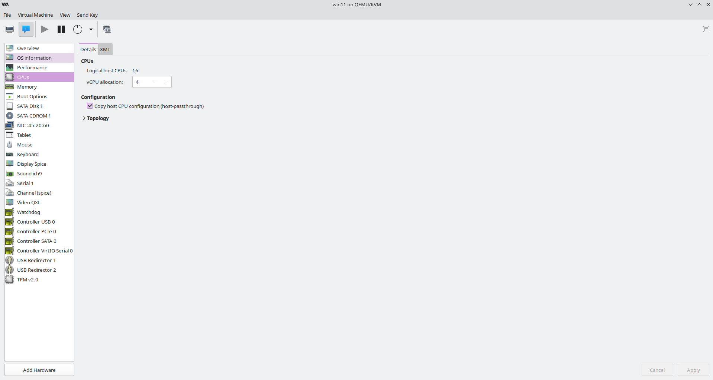
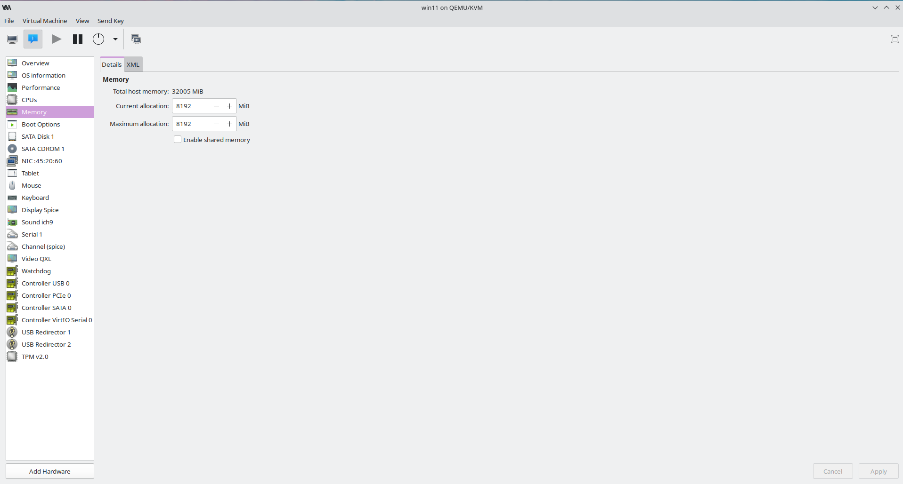

# 🖥️ Windows 11 Virtual Machine Lab

## 📋 Overview

This lab focuses on creating and configuring a Windows 11 virtual machine using Virtual Machine Manager on a Linux Mint host system.

The virtual machine serves as a dedicated environment for practicing IT support, system administration, networking, cybersecurity, and help desk tasks.

---

## 🎥 Video Demonstration

📺 **Watch the complete lab walkthrough on YouTube:**

---

## 🎯 Objectives

- Create a Windows 11 virtual machine
- Configure virtual hardware resources
- Practice Windows administration
- Build a safe testing environment
- Prepare for future IT and cybersecurity labs

---

## 🛠️ Tools Used

| Tool | Purpose |
|---|---|
| Linux Mint | Host operating system |
| Virtual Machine Manager | VM creation and management |
| Windows 11 | Guest operating system |

---

## ⚙️ Configuration

### Virtual Machine Overview

### CPU Configuration

### Memory Configuration

---

## 💡 Skills Demonstrated

- Virtualization
- Windows 11 administration
- Virtual machine management
- Resource allocation
- IT lab environment setup

---

## 🚀 Future Lab Activities

- Active Directory
- osTicket
- Wireshark
- Network Troubleshooting
- Security Testing
